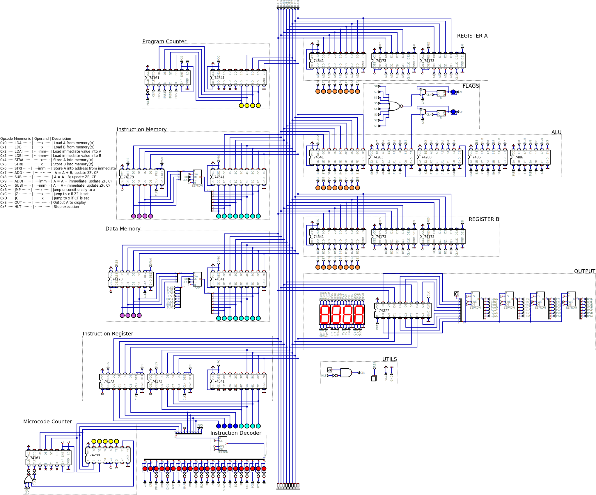
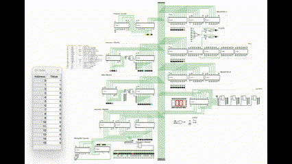

# 8-bit CPU Simulation (Digital by hneemann)

This is a custom-built 8-bit CPU designed and simulated using the [Digital](https://github.com/hneemann/Digital) logic simulator.

### 🧠 Features
- 16-instruction custom instruction set
- 4-bit opcode + 8-bit operand (12-bit instruction)
- Microcoded control using EEPROM
- ZF (Zero) and CF (Carry) flags
- Separate instruction and data memory

### 🚀 Sample Programs
- Fibonacci sequence generator (0–255)
- Simple counter (0–255-0)

### 📸 Screenshots

### 🎥 Demo

---

### 📂 File Structure

- `project/`: Main `.dig` simulation files (full CPU circuit)
- `programs/`: Instruction memory programs (e.g., Fibonacci, counter)
- `instruction_decoder/`: Microcode EEPROM generator
- `seven_segment_display_decoder/`: Optional decoders for output display
- `images/`: Circuit overview and simulation screenshots or GIFs

---

### 💻 Requirements
- [Digital Logic Simulator](https://github.com/hneemann/Digital)

